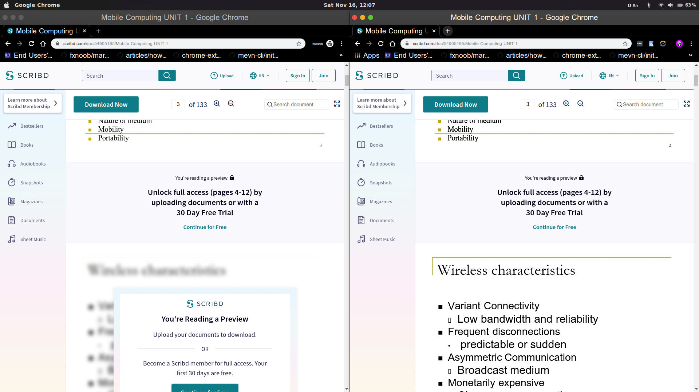

<h1 align="center">nice-try-scribd</h1>

Unblur Scribd Documents...

<h3 align="center">🙋‍♂️ Made by <a href="https://twitter.com/_abhijithv">@abhijithvijayan</a></h3>

  Donate:
  <a href="https://www.paypal.me/iamabhijithvijayan" target='_blank'><i><b>PayPal</b></i></a>,
  <a href="https://www.patreon.com/abhijithvijayan" target='_blank'><i><b>Patreon</b></i></a>

  

 

##  Download for browser(s)

  - Firefox: [Nice Try Scribd :: Add-ons for Firefox](https://addons.mozilla.org/en-US/firefox/addon/nice-try-scribd/)
  - Other Browsers: [Download from releases](https://github.com/abhijithvijayan/nice-try-scribd/releases)

## Template

- [abhijithvijayan/web-extension-starter](https://github.com/abhijithvijayan/web-extension-starter)

## 🚀 Quick Start

- `yarn install` to install dependencies.
- `yarn run dev:chrome` to start the development server for chrome extension.
- `yarn run dev:firefox` to start the development server for firefox addon.
- `yarn run dev:opera` to start the development server for opera extension.
- `yarn run build:chrome` to build chrome extension.
- `yarn run build:firefox` to build firefox addon.
- `yarn run build:opera` to build opera extension.
- `yarn run build` builds and packs extensions all at once to extension/ directory.

## Getting Started

### Development

- `yarn install` to install dependencies.
- To watch file changes in developement

  - Chrome
    - `yarn run dev:chrome`
  - Firefox
    - `yarn run dev:firefox`
  - Opera
    - `yarn run dev:opera`

  (Reload Extension Manually in the browser)

- **Load extension in browser**

  - ### Chrome

    - Go to the browser address bar and type `chrome://extensions`
    - Check the `Developer Mode` button to enable it.
    - Click on the `Load Unpacked Extension…` button.
    - Select your extension’s extracted directory.

  - ### Firefox

    - Load the Add-on via `about:debugging` as temporary Add-on.
    - Choose the `manifest.json` file in the extracted directory

  - ### Opera

    - Load the extension via `opera:extensions`
    - Check the `Developer Mode` and load as unpacked from extension’s extracted directory.

### Production

- `yarn run build` builds the extension for all the browsers to `extension/BROWSER` directory respectively.

## Template

Generated from https://github.com/abhijithvijayan/web-extension-starter

## Show your support

Give a ⭐️ if this project helped you!

## Licence

Code released under the [MIT License](LICENSE).
